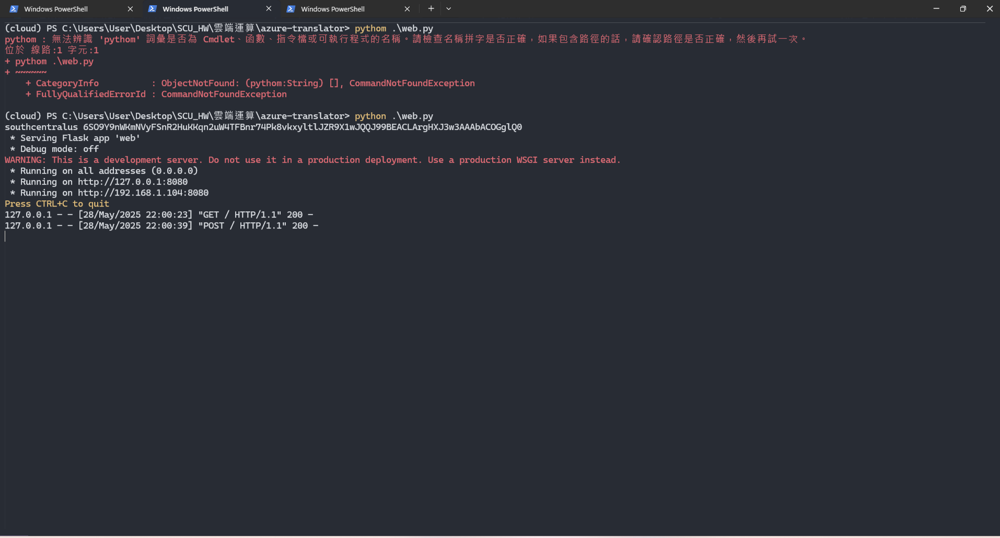
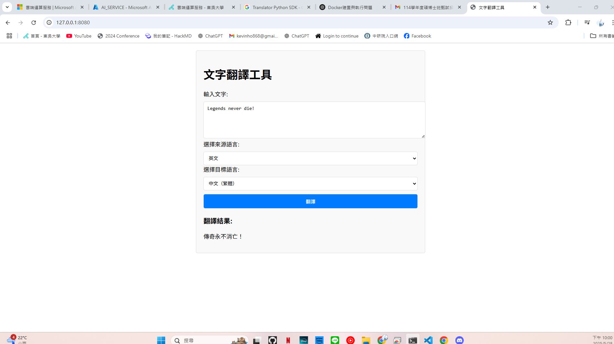
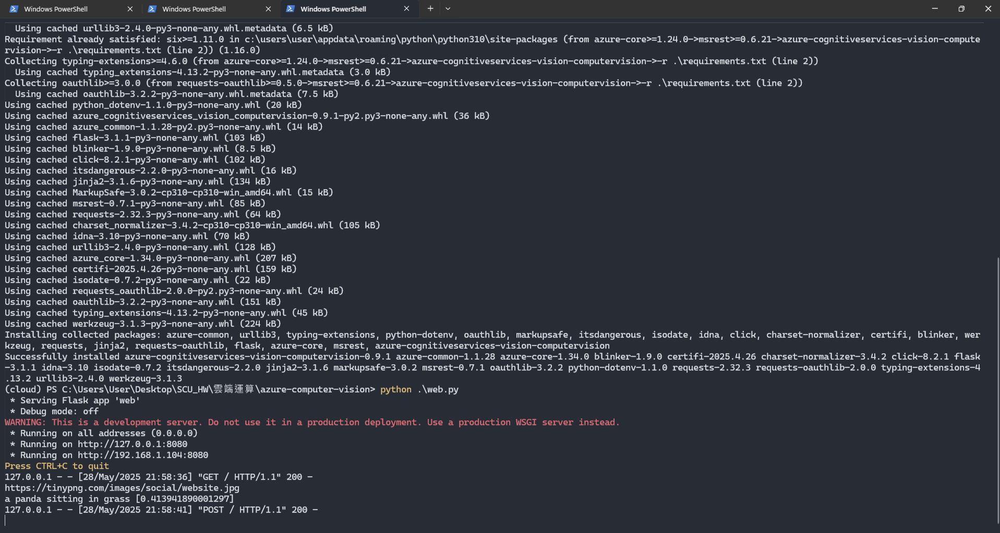
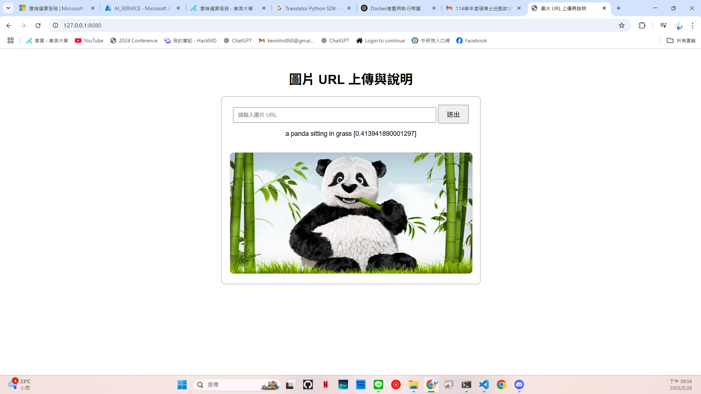
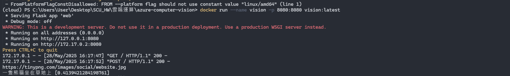
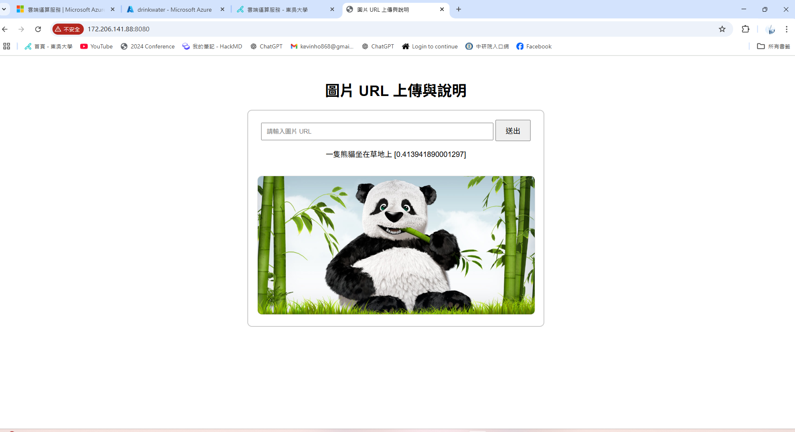

#### 雲端運算服務作業 (Azure容器應用)

| 系級  | 資科四B | 學號  | 10173214 | 姓名  | 何書維 |
| :---: | :-----: | :---: | :------: | :---: | :----: |

---

##### 相關操作說明:

1. 建立翻譯工具服務
   先利用下面的指令下載[翻譯工具的github](https://github.com/coachsu-azure/azure-translator)

   ```
   git clone https://github.com/coachsu-azure/azure-translator
   ```
   接著創建conda 虛擬環境，並安裝相關套件
   ```
   conda create -n cloud python==3.10.13 # 雖然github選擇的是3.14版本，但我認為這個版本在安裝大部分套件時是最穩定的，因此選用
   pip install -r requirement.txt

   ```
   接著到Microsoft Azure建立資源群組及翻譯工具

   建立完之後，到翻譯工具下找尋金鑰，將其與地區的值複製貼入道專案中的./env檔案對應的參數，並利用下面的指令執行程式
   ```
   python web.py
   ```
   就會如下圖所示
    <br>
    <div style="text-align: center;">
    
    </div>
    <br>
    點開(http://127.0.0.1:8080)的連結之後，輸入自身想翻譯的文字並點選翻譯即可出現

    <br>
    <div style="text-align: center;">
    
    </div>
    <br>


2. 建立影像分析服務

    如同上面的指令，將github換成[computer vision](https://github.com/coachsu-azure/azure-computer-vision)，丟入網路上一張[熊貓的圖片連結](https://tinypng.com/images/social/website.jpg)，點選送出即可回傳**英文**的描述
    <br>
    <div style="text-align: center;">
    
    </div>
    <br>
    <br>
    <div style="text-align: center;">
    
    </div>
    <br>

3. 服務串接&容器化

    由於最後呈現會是在影像分析的部分，因此將影像分析的web\.py做一些修改如下所示:

    ```
    """
    Azure AI 電腦視覺(網頁版)
    """

    import os
    import pathlib
    from dotenv import load_dotenv
    from flask import Flask, request, render_template
    from azure.cognitiveservices.vision.computervision import ComputerVisionClient
    from msrest.authentication import CognitiveServicesCredentials
    from azure.ai.translation.text import TextTranslationClient, TranslatorCredential
    from azure.ai.translation.text.models import InputTextItem


    # 如果.env存在，讀取.env檔案
    env_path = pathlib.Path(".env")
    if env_path.exists():
        load_dotenv(dotenv_path=env_path, override=True)

    # 取得環境變數
    KEY = os.getenv("KEY")
    ENDPOINT = os.getenv("ENDPOINT")

    ## 翻譯工具
    TRANS_KEY = os.getenv("TRANS_KEY")
    TRANS_ENDPOINT = os.getenv("TRANS_ENDPOINT")
    TRANS_REGION = os.getenv("TRANS_REGION")

    text_translator = TextTranslationClient(
        endpoint=TRANS_ENDPOINT, credential=TranslatorCredential(TRANS_KEY, TRANS_REGION)
    )

    SRC = "en"
    DST = ["zh-hant"]


    app = Flask(__name__)


    @app.route("/", methods=["GET", "POST"])
    def object_detection():
        """
        Azure AI 電腦視覺(網頁版)
        """
        image_url = ""
        language = "en"
        description = ""

        if request.method == "POST":
            image_url = request.form.get("image_url")

            print(image_url)

            client = ComputerVisionClient(
                endpoint=ENDPOINT, credentials=CognitiveServicesCredentials(KEY)
            )

            analysis = client.describe_image(
                url=image_url, max_descriptions=1, language=language
            )
            result = analysis.captions[0]
            # 將回傳值進行翻譯
            translate = [InputTextItem(text=result.text)]
            responses = text_translator.translate(
                content=translate, to=DST, from_parameter=SRC
            )
            description = f"{responses[0].translations[0].text} [{result.confidence}]"

            print(description)

        return render_template("index.html", image_url=image_url, description=description)


    if __name__ == "__main__":
        app.run(host="0.0.0.0", port=8080)

    ```

    除了程式碼加入翻譯工具套件以外，因為要連接翻譯工具的金鑰、端點以及地區，因此也在影像分析的./env中加入如程式碼中的相應參數

    接著在本機端上執行下面的指令，看是否能夠成功執行
    ```
    docker image build -t vision:latest .
    docker run --name vision -p 8080:8080 vision:latest

    ```
    執行成功畫面會如下圖所示:

    <br>
    <div style="text-align: center;">
    
    </div>
    <br>

    接著回到Azure中，建立Container registry，建立能夠透過docker 登入到Azure的帳戶，隨後找尋帳戶並在終端機上輸入以下指令
    ```
    docker login devotion.azurecr.io
    docker image build -t devotion.azurecr.io/vision:latest .
    docker image push devotion.azurecr.io/vision:latest

    ```
    來將映像檔導入Azure的Container中，接著建立容器執行個體並將網路的TCP port改成8080，建立之後利用容器執行個體產生的IP加上:8080到網頁上，即可跳出影像分析的網站，將上面丟過的圖片再丟入並送出，即可產生翻譯成中文的描述

    <br>
    <div style="text-align: center;">
    
    </div>
    <br>

---


##### 心得

這次實作與上次較為不同，上次只需專注在雲端不同虛擬機的連線確認連線即可，但這次作業作為期末專題的前哨，比起上次只要連線成功即可這次多了更多實際的作用，而我本次作業遇到最大的困難點也出現在將翻譯工具以及圖片辨識進行串接，修改了本地端的程式碼數次，不斷將測試結果PUSH上去，都快將大部分地區的定價層免費額度都用光了，所幸最後還是順利完成作業，成功在額度使用完之前做出結果，讓我鬆了一大口氣。