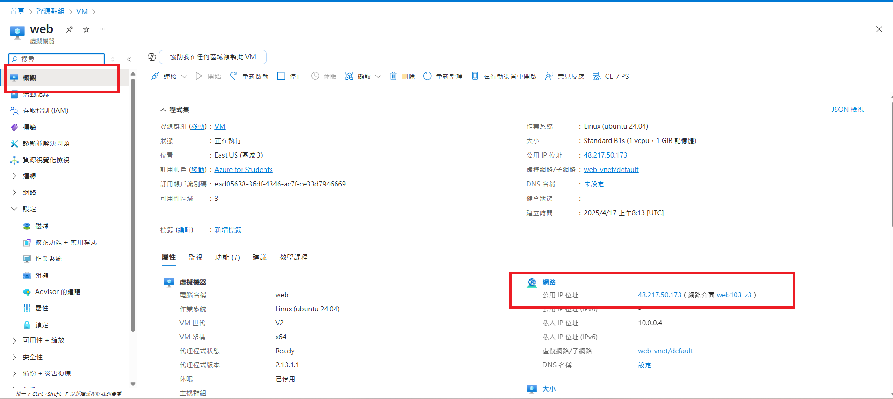
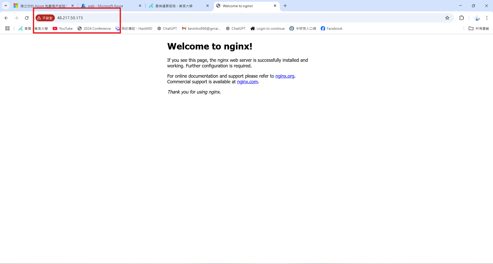
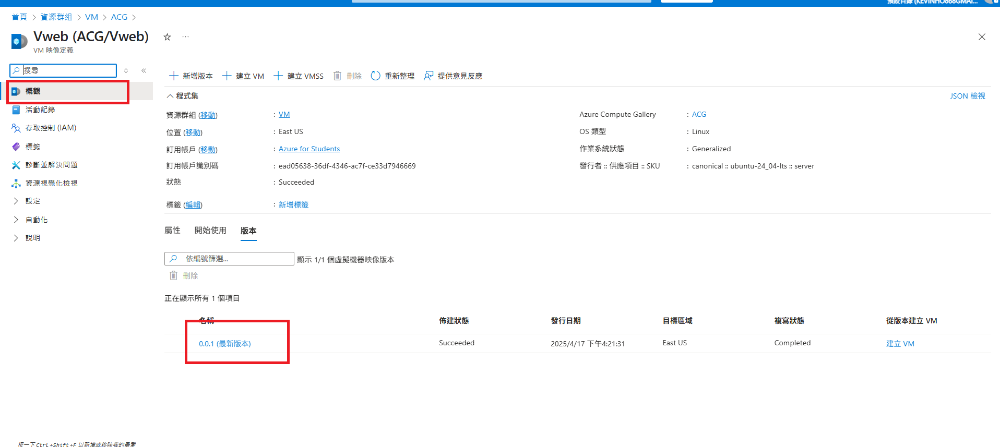
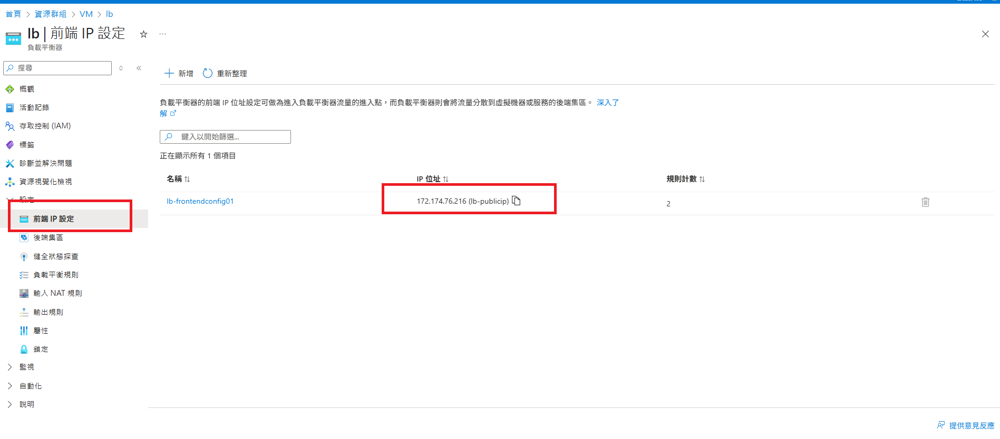
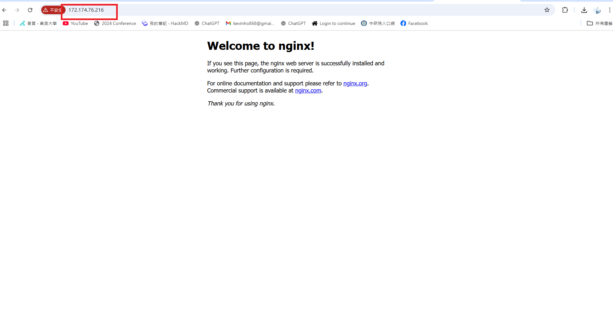
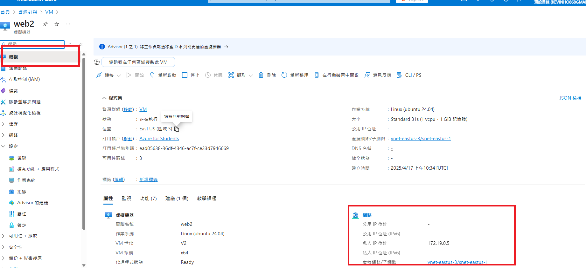
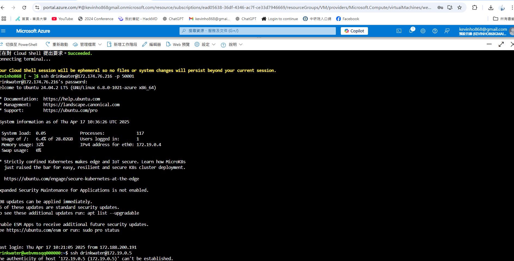

#### 雲端運算服務作業 (Hands-On Labs #1)

| 系級  | 資科四B | 學號  | 10173214 | 姓名  | 何書維 |
| :---: | :-----: | :---: | :------: | :---: | :----: |

--- 

**目標 : 學習使用Azure虛擬機器**

---
###### **Step 1. 建立 Azure 虛擬機器 1**

- 相關操作說明
  -  選取EastU3來建立VM1 (開啟的通訊埠: HTTP(80)、SSH(22))
  -  利用ssh drinkwater@48.217.50.173 進入VM
  -  輸入 sudo apt-get update 先獲取最新package 再輸入 sudo apt install -y nginx 安裝nginx
  -  將 http://48.217.50.173 驗證網站伺服器是否正常執行

   
  

  
  

   

  <b>
  

    
AS1-1: 虛擬機器1的資源畫面(須包含公用 IP 位址) 

  

  <b>

   
  

  
  

   

  <b>
  

    
AS1-2: 以瀏覽器連線至虛擬機器1上網站伺服器的畫面 

  

  <b>
   

---
###### **Step 2. 建立虛擬機器 1映像檔**

- 相關操作說明:
  -  從VM1擷取映像檔並建立新的ACG、設定版本號碼:0.0.1以及目標虛擬機器映像定義(命名為: Vweb)
  -  將映像檔儲存在 Azure Compute Gallery (ACG)上
  -  將VM1刪除並部署VM映像檔

   
  

  
  

   

  <b>
  

    
AS2-1: ACG 映像檔定義的版本列表畫面

  

  <b>
         

---

###### **Step 3. 以映像檔建立虛擬機器 1擴展集**

-  以映像檔建立虛擬機器1擴展集
   -  將公用 IP 位址設置無
   -  使用負載平衡器(建立新的Load Balancer命名為lb 並設置NAT輸入規則 : 50001:22 以及輸出規則)
   -  如同第一步輸入相同的指令，只不過要進入SSH 需要輸入 ssh drinkwater@172.174.72.176 -p 50001 進入

 

 

<b>

AS3-1: 包含負載平衡器公用 IP 的畫面 

<b>
    

 

 

<b>

AS3-2: 以瀏覽器連線至網站伺服器的畫面

<b>
    

---

###### **Step 4. 建立 Azure 虛擬機器 2**

-  如同VM1建立VM2，但是:
   -  將公用 IP 位址設置無
   -  不使用負載平衡器選取無
   -  在網路設定設置與VM1擴展集的虛擬網路(vnet-eastus3/vnet-eastus1)
- 最後從虛擬機器1擴展集透過VM2的私人IP(172.19.0.5)連線到VM2

   
  

  
  

   

  <b>
  

    
AS4-1: 虛擬機器2的資源畫面(須包含私人 IP 位址) 

  

  <b>
      

   
  

  
  

   

  <b>
  

    
AS4-2: 從虛擬機器2透過 SSH 連線到虛擬機器1擴展集的畫面 

  

  <b>
    

---

**心得**

對於這次的作業，算是讓我對於雲端有了初步了解，雖然自身平常有在使用SSH執行影像辨識的相關任務，但對於其背後的運作原理又或者是相關功能並不是很熟悉，此次的作業幫助了我瞭解部分基礎功能的運作原理，讓我能夠在平常更靈活地使用SSH的相關措施，幫助我能夠順利研究我想研究的部分。